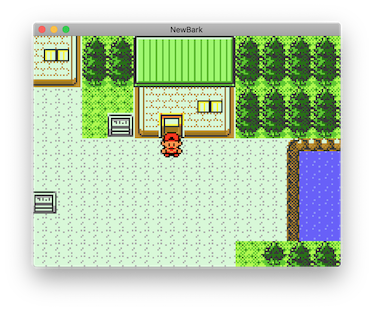

# NewBark
🌳 Retro-style 2D RPG game engine for Unity, inspired on Pokémon Gold and Silver.

## Requirements

- Unity 2019.2.1f1+

## Resources
- [Learning Unity 2D - Video Tutorials](https://www.youtube.com/playlist?list=PL0dOETTrhWWCuWcl2OjB3GfvrlfWEzx18)

## License

This software is copyrighted and licensed under the 
[MIT license](https://github.com/capsulemonsters/newbark/LICENSE).

### Disclaimer

This software comes bundled with data and graphics extracted from the
Pokémon series of video games. Some terminology from the Pokémon franchise is
also necessarily used within the software itself. This is all the intellectual
property of Nintendo, Creatures, inc., and GAME FREAK, inc. and is protected by
various copyrights and trademarks.

The goal of this project is not to create and/or distribute a game, but to learn
how to create similar retro games in Unity. So this project, apart from being a possible
base engine for future similar projects unrelated to the Pokémon franchise,
has mainly educational purposes.

The author believes that the use of this intellectual property for a fan reference
is covered by fair use and that the software is significantly impaired without said
property included. Any use of this copyrighted property is at your own legal risk.

This software is not affiliated in any way with Nintendo,
Pokémon or any other game company.

A complete revision history of this software is available from
https://github.com/capsulemonsters/newbark
