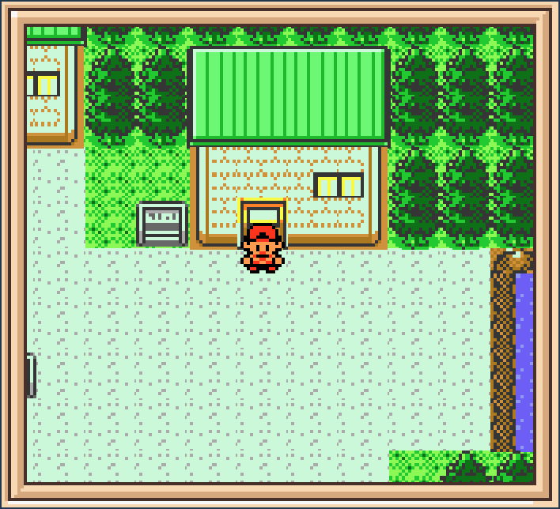

# NewBark
🌳 Retro Pokémon RPG game engine built on top of MelonJS and compatible with Tiled maps editor.

This is currently an early stage prototype and it is not intended to be a final game.
The main goal of this project is to build an RPG game engine for the web, inspired and based on the Pokemon games.

## Setup

First, you may need `gulp` installed globally.

Clone the project:

    git clone https://github.com/pokettomonstaa/NewBark.git
    cd NewBark

Then in the cloned directory, simply run:

    yarn install
    gulp

## Start

After building you need to run the game from a valid HTTP URL (it won't work with local file:// urls).
The recommended way for running it locally is using [`http-server`](https://www.npmjs.com/package/http-server),
which comes already bundled as npm start script:

    npm start

This will serve the static `dist/index.html` file and all the assets at 
[localhost:8080](http://localhost:8080) by default.
